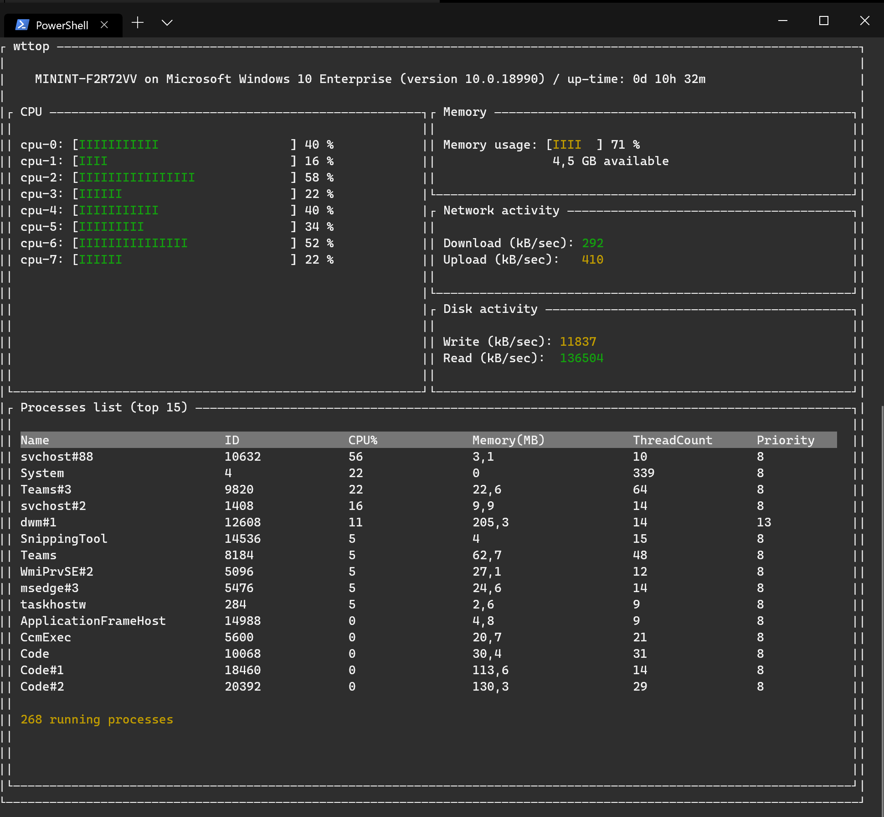

# wttop

You love the new [Windows Terminal](https://github.com/microsoft/terminal)? So do I!

You love [gtop](https://github.com/aksakalli/gtop)? So do I!

That is why I decided to make an equivalent in [dotnetcore](https://github.com/dotnet/core) using [Miguel De Icaza work for Terminal UI](https://github.com/migueldeicaza/gui.cs).

Wttop is a simple system monitor for the terminal:



## Version 1.0

This initial version, although it is built on the cross-platform dotnetcore 3.0, does only support Windows. The reason is that it uses wmi to gather metrics.

However, it is made to be cross-platform. I just need to implement the [ISystemInfo](Core/ISystemInfo.cs) interface for both OSX and Linux.

The widgets available are
* Machine name / version / uptime
* CPU activity (virtual CPUs)
* RAM usage
* Network activity
* Disk activity (aggregation of all disks)
* List of top 15 processes

## Installation

With dotnetcore 3.0, only one self-contained .exe file is used. You do not even need to have dotnetcore 3.0 installed on your machine.

Simply download the [latest version](releases), store it somewhere in your $path, and run the command from the terminal (both PowerShell & CMD shell)

```sh
/> wttop.exe
```

## Todo

[ ] Make it compatible with OSX

[ ] Make it compatible with Linux

[ ] Allow command to kill a process

## License

Wttop is under [MIT license](LICENSE)