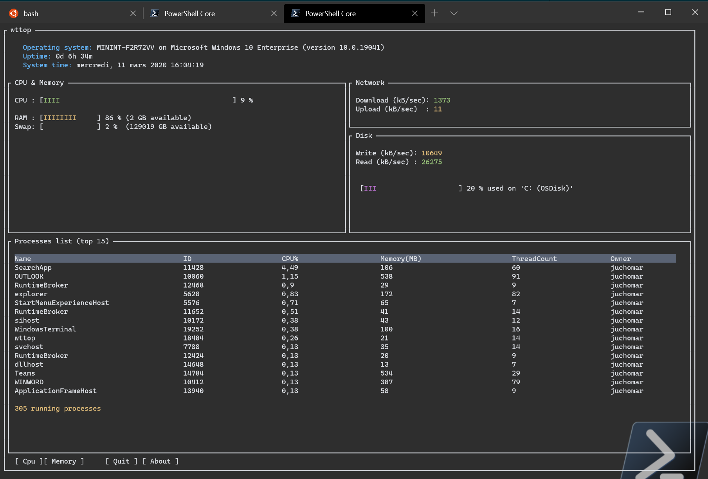

# wttop

You love the new [Windows Terminal](https://github.com/microsoft/terminal)? **So do I**!

You love [gtop](https://github.com/aksakalli/gtop) or [htop](https://github.com/hishamhm/htop)? **So do I**!

That is why I decided to make an equivalent in [dotnetcore](https://github.com/dotnet/core) using [Miguel De Icaza work for Terminal UI](https://github.com/migueldeicaza/gui.cs).

**Wttop** is a simple system monitor for the terminal:



## Version 1.1

This version, although it is built on the cross-platform *dotnetcore 3.1*, does only support **Windows**. The reason is that it uses WMI - P/invoke to gather metrics.

However, it is made to be cross-platform. I just need to implement the [ISystemInfo](Core/ISystemInfo.cs) interface for both OSX and Linux.

The widgets available are:

* Machine name / version / uptime / System time
* CPU activity (virtual CPUs)
* RAM/SWAP usage
* Network activity
* Disk activity (aggregation of all disks)
* Disk usage (list all the available disks)
* List of top 15 processes

## Installation

### Manual

With *dotnetcore 3.1*, only one self-contained .exe file is used. You do not even need to have *dotnetcore 3.1* installed on your machine.

Simply download the [latest version](https://github.com/jchomarat/wttop/releases), store it somewhere in your *$path*, and run the command from the *terminal* (both *PowerShell* & *CMD shell*)

```sh
/> wttop.exe
```

### Via scoop

*coming soon*

## Usage

As of version 1.1, I replaced some WMI calls by p/invoke, much quicker. I have also introduced a couple of commands:

* Press *C* to order processes by CPU usage (default)
* Press *M* to order processes by Memory usage
* Press *Q* to quit

## Todo

[x] Add system time widget

[ ] Make it compatible with OSX

[ ] Make it compatible with Linux

[ ] Allow command to kill a process

[ ] Investigate the ability to adjust layout, via config file for instance

## License

Wttop is under [MIT license](https://github.com/jchomarat/wttop/blob/master/LICENSE)
